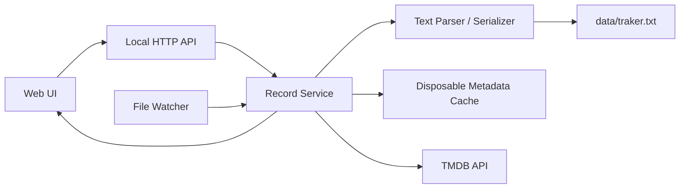

# Traker 架构设计

状态：草案
版本：0.1
日期：2026-07-20

## 1. 项目目标

Traker 是一个本地优先、文本优先的个人影视追踪工具。

它首先解决“随时快速记下想看、在看和看过的影视内容”这个问题。图形界面用于提升搜索、筛选、编辑、统计和元数据浏览体验，但不能成为访问个人数据的必要条件。

核心要求：

- 使用任意文本编辑器都能读取和修改全部核心记录。
- 最简单的记录只需要输入一个状态符号和标题。
- 应用退出、损坏或被替换后，文本记录仍然完整可用。
- 电影和剧集使用同一套记录格式。
- TMDB 匹配结果写入文本，海报、简介和演员等派生数据单独缓存。
- 外部修改文本后，应用能够安全地重新加载。

## 2. 架构原则

### 2.1 文本是唯一事实来源

默认数据文件为 `data/traker.txt`。其中保存用户主动记录的信息，以及用于关联外部元数据的 TMDB ID。

数据库、搜索索引、海报和元数据缓存都不能成为恢复记录所必需的内容。删除全部缓存后，应用应当能够仅根据 `traker.txt` 恢复记录列表，并重新获取外部元数据。

### 2.2 优先保证输入效率

格式以符号约定为主，不要求用户输入 `status=watched` 一类键值字段。

最短记录示例：

```text
- 遗传厄运
x 心灵奇旅
```

所有日期、评分、进度、标签、短评和外部 ID 都是可选内容。

### 2.3 宽松读取，保守写入

解析器应尽可能读取合法部分，并为不合法部分提供警告。任何无法识别的行或标记都必须保留原文，不能在保存时被静默删除。

应用修改一条记录时，只修改目标行。不得因为排序、格式化或解析器升级而重写其他行。

### 2.4 用户数据与派生数据分离

写入主文本的数据：

- 状态
- 用户使用的标题
- TMDB 媒体类型和 ID
- 完成日期和创建日期
- 个人评分
- 观看进度
- 标签
- 短评

只写入缓存的数据：

- 标准标题和原始标题
- 上映日期
- 类型题材
- 简介
- 海报路径
- 演员和剧组信息
- TMDB 公共评分
- 搜索结果

TMDB 返回的标题不能自动覆盖用户填写的标题。

## 3. 功能范围

### 3.1 第一阶段

- 读取、解析和展示文本记录。
- 快速添加电影或剧集。
- 编辑状态、完成日期、创建日期、评分、进度、标签和短评。
- 删除记录，并提供可恢复的备份。
- 按状态以及电影（`tm:`）/剧集（`tv:`）类型筛选；搜索同时匹配用户标题、TMDB 标准标题、TMDB 原始标题、演员、题材、标签和短评。详情页的演员姓名可以点击并跳转到片单搜索。
- 按文件顺序、完成日期、创建日期和评分排序。
- 展示基础统计。
- 搜索 TMDB，由用户确认匹配结果。
- 快速添加记录后立即打开 TMDB 匹配页，由用户确认单条结果。
- 对尚未包含 TMDB ID 的记录执行批量自动匹配，并采用每次搜索的第一条结果。
- 单条或批量匹配产生重复 `tm:`/`tv:` ID 时提示用户，但不阻止保存或自动合并，因为重复记录可能代表重看。
- 将 `tm:` 或 `tv:` ID 写回对应文本行。
- 缓存海报、简介和主要演员信息。
- 按 TMDB ID 顺序查询多个 Emby 服务，并在电影详情页使用 ArtPlayer 直接播放媒体。
- 检测外部文本修改并刷新界面。

### 3.2 暂不纳入核心架构

- 多用户和社交功能。
- 云端账户体系。
- Plex 或其他媒体服务器集成。
- 自动跨设备冲突合并。
- 复杂推荐算法。

这些能力后续可以作为独立集成增加，不能改变主文本格式的可用性。

## 4. 文本格式

### 4.1 基本示例

```text
# Traker

- 遗传厄运 tm:493922 2026.07.01 +恐怖
> 黑镜 tv:42009 2026.07.01 ~S03E02 +英剧
x 心灵奇旅 tm:508442 2026.07.20 2026.07.01 *5 +动画 +皮克斯 | 第二次看依然很好
! 西部世界 tv:63247 2026.07.20 2026.07.01 ~S02 | 暂时不想继续看
```

### 4.2 行结构

```text
[状态] <标题> [TMDB ID] [日期区] [评分] [进度] [标签...] [| 短评]

日期区 := 创建日期 | 完成日期 创建日期
```

除标题外，其余部分均可省略。省略状态时记录按“想看”处理。日期区只有一个日期时，该日期是创建日期；只有 `x` 和 `!` 状态可以使用包含两个日期的形式。除两个日期之间的先后关系固定外，其他元数据标记在短评分隔符 `|` 之前可以按任意顺序出现。应用生成记录时使用上面的标准顺序，但不主动调整用户已有的顺序。

### 4.3 状态

| 符号 | 含义 |
| --- | --- |
| `-` | 想看 |
| `>` | 在看 |
| `x` | 看过 |
| `!` | 弃看 |

状态符号可以省略，省略时默认为“想看”，且不会产生格式警告。显式状态符号必须是记录行的第一个非空白字符，符号后至少有一个空格或制表符；因此 `x战警` 会作为无状态符号的想看标题读取。

应用新建或保存记录时仍使用包含状态符号的标准格式，想看记录写出 `-`。未被应用修改的无符号记录保持原文。

### 4.4 TMDB ID

```text
tm:508442
tv:42009
```

- `tm:<数字>` 表示 TMDB Movie ID。
- `tv:<数字>` 表示 TMDB TV ID。
- 一条记录最多包含一个 TMDB ID。
- TMDB ID 由应用搜索后写入；单条匹配由用户确认，用户主动触发的批量匹配采用第一条结果。手工输入不属于主要使用流程。
- `@` 不参与当前格式，保留给未来用途。
- 旧格式 `tmdb:<数字>` 在迁移时按电影 ID 处理。

必须区分 `tm:` 和 `tv:`，因为 TMDB 的电影 ID 和剧集 ID 属于不同命名空间。

### 4.5 日期

```text
2026.07.20
2026.07.20 2026.07.01
```

- 标准格式为 `YYYY.MM.DD`。
- 读取时兼容省略月份、日期前导零的 `YYYY.M.D`，以及使用连字符的 `YYYY-M-D`；解析后统一为 `YYYY.MM.DD`，应用保存时只写标准格式。
- 没有日期时，创建日期和完成日期都未知。
- 只有一个日期时，该日期始终代表创建日期，与当前状态无关。
- 只有状态为 `x`（看过）或 `!`（弃看）的记录允许出现两个日期。
- 出现两个日期时，第一个代表完成或结束日期，第二个代表创建日期。
- 通过界面或 API 保存看过、弃看记录时，如果只填写完成或结束日期而没有创建日期，应用将创建日期补为同一天，并在文本中写出两个相同日期。
- “完成日期在创建日期前面”只规定它们在文本中的位置，不限制两个日期在日历上的先后关系。
- 状态为 `-`（想看）或 `>`（在看）的记录出现两个日期时，解析器必须保留原文并报告格式警告，不能自行猜测日期含义。
- 同一行出现三个或更多日期时，解析器必须保留原文并报告格式警告。
- 不完整日期可以作为未来扩展，第一阶段不主动生成。

示例：

```text
- 遗传厄运 2026.07.01
> 黑镜 2026.07.01 ~S03E02
x 心灵奇旅 2026.07.20 2026.07.01 *5
! 西部世界 2026.07.18 2026.07.01 ~S02
```

以上每行最后一个日期都是创建日期；后两行在它前面额外包含完成或结束日期。

### 4.6 评分

```text
*1
*5
```

- 评分范围为 1 至 5。
- 一条记录最多包含一个评分。
- 超出范围的内容不作为评分解析，并产生格式警告。

### 4.7 进度

```text
~S03E02
~S02
~E08
```

- `~` 后直到下一个空白字符的内容为进度。
- 第一阶段不强制进度内部格式，仅将其作为一个紧凑字符串保存。
- UI 可以识别常见的 `SxxExx` 格式，但不能拒绝其他用户输入。

### 4.8 标签

```text
+科幻
+日本电影
```

- `+` 后直到下一个空白字符的内容为一个标签。
- 一条记录可以包含多个标签。
- 标签本身不包含空格。

### 4.9 短评

```text
| 第二次看依然很好
```

- 第一个未转义的 `|` 是短评分隔符。
- `|` 后面的全部内容都是短评，不再解析日期、评分、进度、标签或 TMDB ID。
- 第一阶段短评只占一行。
- 短评中的字面量 `|` 写作 `\|`。

### 4.10 注释与空行

- 空行忽略并原样保留。
- 第一个非空白字符为 `#` 的行是文件注释。
- 标签只使用 `+标签`；记录行中的 `#` 不作为标签标记。

### 4.11 转义

只有在内容可能被误识别为格式标记时才需要转义：

```text
\|    字面量竖线
\+    字面量加号
\*    字面量星号
\~    字面量波浪号
\\    字面量反斜杠
```

转义属于边缘能力，普通记录不需要使用。

### 4.12 解析判定

格式标记只有在满足以下条件时才被识别：

- 位于短评分隔符之前。
- 是由空白分隔的完整 token。
- 满足对应的严格格式，例如 `*5`、`tm:508442`。
- 没有被反斜杠转义。

除状态外，无法识别的 token 作为标题的一部分保留。解析器同时返回原始行和警告列表，以便界面展示问题而不丢失内容。

## 5. 记录语义

一行表示一条追踪记录。记录通常随状态变化而更新：

```text
- 心灵奇旅 2026.07.01
> 心灵奇旅 2026.07.01
x 心灵奇旅 2026.07.20 2026.07.01 *5
```

以上通常是同一行在不同时期的状态，而不是同时存在的三行。

重看同一部电影时允许新增一行，并复用相同 TMDB ID：

```text
x 心灵奇旅 tm:508442 2024.03.12 2024.01.10 *5
x 心灵奇旅 tm:508442 2026.07.20 2026.07.15 *4 | 第二次看
```

因此 TMDB ID 是媒体标识，不是记录行的唯一标识。

## 6. 运行时数据模型

解析后的记录模型建议为：

```text
Record
  key              当前文件版本内的临时行标识
  status           planned | watching | watched | dropped
  title            用户标题
  mediaRef         tm:<id> | tv:<id> | null
  completedAt      date | null
  createdAt        date | null
  rating           1..5 | null
  progress         string | null
  tags             string[]
  comment          string | null
  rawLine          原始文本
  lineNumber       当前行号
  warnings         ParseWarning[]
```

`key` 由“文件版本、原始行内容和同内容出现序号”生成，只用于一次 API 交互，不写入文本。这样可以保持文本干净，同时允许重复记录。

任何更新请求都必须同时携带文件 `revision`。如果外部编辑器已经修改文件，后端返回冲突，前端重新加载后让用户再次确认修改，不能覆盖外部变更。

## 7. 系统组成

推荐保留前后端分离的代码边界，但生产环境由同一个本地服务提供页面和 API：



### 7.1 前端职责

- 列表、搜索、筛选、排序和统计。
- 快速添加与编辑交互。
- 显示解析警告和写入冲突。
- 发起 TMDB 搜索并让用户选择正确结果。
- 展示缓存的海报、简介和演员信息。
- 收到文件变更通知后刷新数据。

前端不直接解析或写入文件，避免浏览器、桌面封装和未来客户端产生不同的格式实现。

### 7.2 后端职责

- 唯一的文本解析与序列化实现。
- 文件读取、追加、修改、删除和备份。
- 文件版本检测和并发冲突保护。
- 监听外部文件变化。
- TMDB 请求、限流、缓存和图片下载。
- 提供同源静态页面和本地 API。

### 7.3 技术选型建议

- 前端：React、TypeScript、Vite。
- 后端：ASP.NET Core Minimal API。
- 持久化：UTF-8 文本文件。
- 元数据缓存：JSON 文件和本地图片目录。
- 搜索索引：后端内存索引，文件变化后重建。

现有项目技术栈可以作为参考，但新实现不要求兼容现有组件和接口。

## 8. 文件布局

建议布局：

```text
data/
  traker.txt                 核心记录，用户直接管理
  backups/                   应用写入前的滚动备份
  cache/
    metadata.json            可重建的 TMDB 元数据
    images/                  可重建的海报和头像
```

数据文件路径必须可以通过配置指定。用户可以将 `traker.txt` 放进 Git、Syncthing、Dropbox 或其他同步工具，但同步冲突由相应工具处理，Traker 第一阶段只负责检测本地文件版本变化。

## 9. 文件写入安全

应用发起写入时必须执行：

1. 获取进程内写锁。
2. 校验客户端提交的 `revision` 与当前文件一致。
3. 再次读取当前文件。
4. 仅替换、插入或删除目标行。
5. 在同目录写入临时文件。
6. 刷新临时文件内容。
7. 创建滚动备份。
8. 使用原子替换将临时文件替换为主文件。
9. 释放写锁并通知客户端新版本。

应用应保留原始换行风格，并默认使用 UTF-8。解析失败不能阻止读取其他记录，但包含严重格式警告的目标行在被修改前需要用户确认。

## 10. 外部编辑同步

后端使用文件监听器检测 `traker.txt` 的修改，并进行短时间防抖，避免编辑器一次保存触发多个事件。

推荐流程：

1. 文件发生变化。
2. 后端重新读取并计算 `revision`。
3. 重建内存记录和搜索索引。
4. 通过服务端事件通知已打开的前端。
5. 前端重新请求记录。

如果前端存在尚未提交的编辑，应提示文件已经变化，而不是自动覆盖编辑内容。

## 11. TMDB 集成

TMDB 匹配流程：

1. 用户添加标题，记录可以暂时没有 ID。
2. 前端请求电影、剧集或综合搜索。
3. 展示候选项的标题、年份、类型和海报。
4. 用户确认候选项。
5. 后端把 `tm:<id>` 或 `tv:<id>` 插入目标行的短评分隔符之前。
6. 后端下载并缓存详细元数据。

单条新增和手动匹配必须由用户确认搜索结果。用户主动触发“批量匹配”时，应用可以为所有尚未包含 TMDB ID 的记录搜索电影和剧集，并采用每次搜索的第一条结果；无结果或请求失败的记录保持不变。批量写入仍需校验文件 `revision`，并在一次原子写入中完成。

TMDB API Key 必须通过环境变量或本地私有配置提供，不能提交到源码仓库。

### 11.1 Emby 播放

- Emby 服务通过 `EMBY_SERVERS` JSON 数组配置，每项包含服务地址、API Key 和可选名称；数组顺序即查询优先级。
- 后端使用电影记录中的 `tm:` ID 查询 Emby 的 TMDB Provider ID，逐个服务查询，命中第一条结果后停止。
- 电影命中 `Movie` 后返回静态视频流地址，并在不下载完整视频的前提下解析一次重定向。
- 前端使用 ArtPlayer 与浏览器原生 `<video>` 在站内播放最终视频地址；Traker 后端不提供 Range 代理，也不提供跳转到 Emby Web 的备用入口。
- ArtPlayer 使用稳定的 `tm:<id>` 标识记忆播放进度，并提供画中画、倍速、迷你进度条和全屏控制。
- 播放按钮使用点击式分割菜单提供 PotPlayer、mpv-handler 和复制地址；展开菜单时预取并缓存播放地址，用户点击播放器时同步触发已注册的本地协议。
- 前端不解析或转换媒体容器，能否播放取决于浏览器对文件容器和音视频编码的原生支持，MKV 不保证可播放。
- `tv:` 只能定位剧集系列，不能确定具体集数，因此剧集详情暂不显示播放入口。
- Emby 地址和 API Key 只从环境变量或未纳入版本控制的 `.env` 读取，不写入 `traker.txt`、元数据缓存或前端配置。
- 电影详情页只在存在 TMDB ID 时显示播放按钮；未配置、未找到、跨域读取、解码和上游请求失败必须显示明确错误。

## 12. API 草案

```text
GET    /api/records
POST   /api/records
PUT    /api/records/{key}
DELETE /api/records/{key}

GET    /api/tmdb/search?q=...&type=movie|tv|all
POST   /api/records/{key}/tmdb-match

GET    /api/play-link?type=tm&q={tmdbId}
GET    /api/events
GET    /api/images/{cacheKey}
```

`GET /api/records` 返回：

```text
revision
records[]
fileWarnings[]
```

所有修改接口必须接收 `revision`。版本不一致时返回 `409 Conflict` 和最新版本信息。

统计、筛选和排序第一阶段可由前端基于记录列表完成，不需要额外 API。

## 13. 安全边界

默认只监听本机回环地址，并采用同源访问，不开放任意来源 CORS。

如果用户选择监听局域网地址，则必须增加访问令牌或登录保护，因为修改接口可以直接改变本地记录。任何外部服务密钥都只能保存在环境变量或不纳入版本控制的配置文件中。

## 14. 测试要求

文本层是系统中风险最高的部分，应优先测试：

- 每一种合法标记和组合顺序。
- 无日期、单个创建日期，以及完成日期加创建日期的组合。
- 非完成状态包含两个日期时的警告和无损保留。
- 中文、英文、数字和特殊字符标题。
- 转义符和包含格式标记的短评。
- 重复标题、重复 TMDB ID 和重复整行。
- 非法评分、日期、ID 和缺失标题。
- 未识别内容的无损保留。
- 解析后未修改记录的逐字节往返一致性。
- 外部文件变化导致的版本冲突。
- 原子写入失败后的主文件完整性。
- 旧格式迁移和回滚。

前端搜索、组合筛选、排序、时间线分组和重复 TMDB ID 检测应保持为纯函数，并使用独立测试覆盖，避免组件调整改变筛选语义。

## 15. 验收标准

第一阶段架构实现完成时，应满足：

- 不启动 Traker，也能用文本编辑器添加和修改记录。
- 只保留 `traker.txt` 就能恢复全部个人记录。
- 输入 `- 标题` 后可以立即在应用中看到记录。
- TMDB 匹配后，文本中出现正确的 `tm:` 或 `tv:` 标记。
- 删除缓存不会影响评分、日期、进度、标签和短评。
- 外部编辑和应用编辑发生冲突时，不会静默丢失任一方内容。
- 任意无法解析的文本都不会因为应用保存其他记录而消失。

## 16. 精简开发计划

Traker 以个人使用为目标，不增加账号、云同步或大量可选配置。下一阶段只包含：

- 在列表顶部输入标题并回车，创建“想看”记录、写入当天创建日期，然后打开 TMDB 匹配页供用户确认。
- 增加“尚未匹配 TMDB”和“元数据缺失或异常”筛选。元数据不按缓存时间自动失效；只有缓存缺失、损坏、关联海报丢失或用户手动刷新时才重新获取。
- 批量处理没有 `tm:` 或 `tv:` ID 的记录，搜索 TMDB 并采用第一条结果，保留用户原有标题；无结果和失败项目跳过并汇总。
- 保留独立的元数据补全接口，但前端不提供单独按钮；点击“批量匹配”时先调用该接口补全已有 `tm:` 或 `tv:` ID 记录的缺失或异常缓存，再调用自动匹配接口处理无 ID 记录。补全阶段不改写主文本。
- 设置页只读显示当前数据文件的绝对路径。数据文件仍只通过启动参数、`TRAKER_DATA_FILE` 或 `.env` 配置，前端不提供修改或打开目录操作。

### 16.1 观看时间线

时间线定位为根据现有记录推导的“观看时间线”，不记录添加、编辑或 TMDB 匹配等操作历史，不增加事件日志，也不修改主文本格式。

数据规则：

- 只展示状态为看过或弃看并且包含完成/结束日期的记录。
- 看过使用 `completedAt` 作为观看完成日期，弃看使用 `completedAt` 作为结束日期。
- 想看、在看记录不进入时间线；看过或弃看但没有日期的记录只统计为“日期未记录”，不混入有日期的时间线。
- 同一影视存在多条重看记录时，每条记录作为一次独立事件展示。
- 时间线完全由 `GET /api/records` 的现有快照在前端计算，不增加后端接口和持久化数据。

界面计划：

- 左侧导航增加独立的“观看时间线”入口，不与文字、海报两种片单显示模式混合。
- 时间线按完成日期倒序排列，并按年份、月份分组。
- 顶部提供标题搜索、年份、看过/弃看状态和类型题材筛选。
- 页面摘要显示当前结果中的看过数量、弃看数量和总数。
- 每条记录显示日期、标题、小海报、看过或弃看状态、电影/剧集类型、个人评分、最多两个类型题材和一行短评。
- 点击时间线记录复用现有影视详情弹窗；时间线不直接展示 TMDB ID、完整简介、演员列表或创建日期。
- 没有完成/结束日期的看过、弃看记录在页面底部显示数量提示。

验收标准：

- 切换时间线不会修改 `traker.txt` 或元数据缓存。
- 年份、状态、题材和标题筛选可以组合使用。
- 月份与记录在各自分组内保持倒序。
- 重看记录不会因为标题或 TMDB ID 相同而被合并。
- 桌面端和移动端均能清晰查看并打开记录详情。
